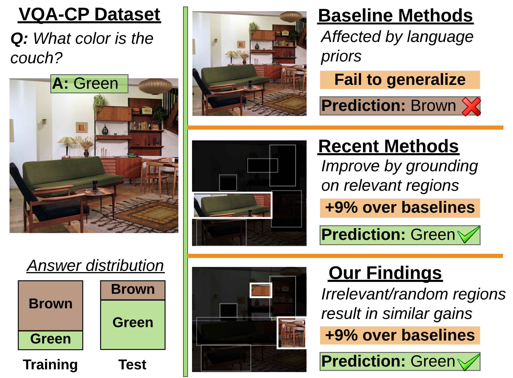

# A negative case analysis of visual grounding methods for VQA (ACL 2020 short paper)
Recent works in VQA attempt to improve visual grounding by training the model to attend to query-relevant visual regions. Such methods
 have claimed impressive gains in challenging datasets such as VQA-CP. However, in this work we show that boosts in performance come from a regularization effect as opposed to proper visual grounding.

This repo is based on [Self-Critical Reasoning codebase](https://github.com/jialinwu17/self_critical_vqa). 

### Install dependencies
We use Anaconda to manage our dependencies. You will need to execute the following steps to install all dependencies:

- Edit the value for `prefix` variable in `requirements.yml` file, by assigning it the path to conda environment

- Then, install all dependencies using:
``conda env create -f requirements.yml``

- Change to the new environment:
``source activate negative_analysis_of_grounding``

- Install:
``python -m spacy download en_core_web_lg``

### Executing scripts
While executing scripts, first ensure that your main project directory is in PYTHONPATH:

``cd ${PROJ_DIR} && export PYTHONPATH=.``
    

### Setting up data
- Inside `scripts/common.sh`, edit `DATA_DIR` variable by assigning it the path where you wish to download all data 
- Download UpDn features from [google drive](https://drive.google.com/drive/folders/1IXTsTudZtYLqmKzsXxIZbXfCnys_Izxr?usp=sharing) into `${DATA_DIR}` folder
- Download questions/answers for VQAv2 and VQA-CPv2 by executing `./scripts/download.sh`
- Preprocess VQA datasets by executing: `./scripts/preprocess.sh`    
    
### Training baseline model
We are providing [pre-trained models for both VQAv2 and VQA-CPv2 here](https://drive.google.com/drive/folders/1pEqgN7uM_FbjUf6VCPGsHnsGvl5oEbcX?usp=sharing)

To train the baselines yourself execute `./scripts/baseline/vqacp2_baseline.sh`.

- *Note#1: We need pre-trained baseline model to train HINT/SCR and our regularizer.*
- *Note#2: We need to train baselines on 100% of the training set. However, by default, the training script expects to train only on subset with visual hints (e.g., HAT or textual explanations).
So, to train baseline, we need to use the flag `--do_not_discard_items_without_hints`, otherwise it will throw an error message saying that `hint_type` flag is missing.*

### Training state-of-the-art models

#### Setting up data
- Download visual cues/hints from https://drive.google.com/drive/folders/1fkydOF-_LRpXK1ecgst5XujhyQdE6It7?usp=sharing into the following directory:
`${DATA_DIR}/hints`
   - The shared folder contains Human Attention Map-based cues and Textual Explanations-based cues
   - The folder contains 3 versions for each type of cue: a) relevant cues (original) b) irrelevant cues (1 - relevant) c) random cues 

The following scripts train HINT/SCR with a) relevant cues b) irrelevant cues c) fixed random cues and d) varying random cues: 

#### Training HINT [1]

Execute `./scripts/hint/vqacp2_hint.sh` for VQACPv2

Execute `./scripts/hint/vqa2_hint.sh` for VQAv2
 
#### Training SCR [2]
Execute `./scripts/scr/vqacp2_scr.sh` for VQACPv2

Execute `./scripts/scr/vqa2_scr.sh` for VQAv2

*Note: By default, HINT and SCR are only trained on subset with visual cues. To train on full dataset, please specify `--do_not_discard_items_without_hints` flag.* 

#### Training our regularizer 

### Analysis
#### Computing rank correlation

#### Visualizing with Grad-Cam

### References

[1] Selvaraju, Ramprasaath R., et al. "Taking a hint: Leveraging explanations to make vision and language models more grounded." Proceedings of the IEEE International Conference on Computer Vision. 2019.

[2] Wu, Jialin, and Raymond Mooney. "Self-Critical Reasoning for Robust Visual Question Answering." Advances in Neural Information Processing Systems. 2019.